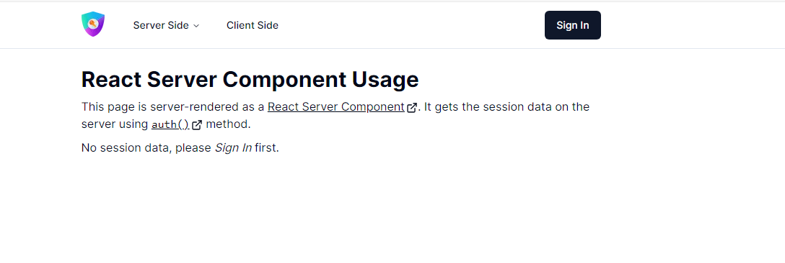
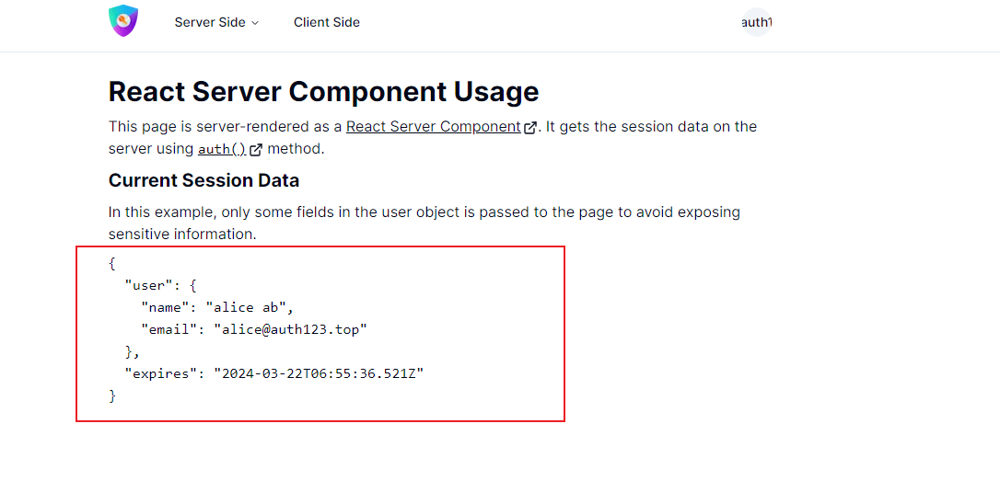

# Overview

This is an example application that shows how `auth.js` is applied to a basic Next.js app.

The OAuth provider is keycloak (deployed in <https://auth123.top>)

## Start the application

To run your site locally, use:

```
npm run dev
```

To run it in production mode, use:

```
npm run build
npm run start
```

To login this example, use:

```
| Username | Password | Roles        |
|----------|----------|--------------|
| admin    | admin    | admin,user   |
| alice    | alice    | user         |
```

## Screenshot





## Reference

1. This example is fork from [an example of NextAuth.js](https://github.com/nextauthjs/next-auth/tree/main/apps/examples/nextjs),
please refer to it for details.
2. [Auth.js](https://authjs.dev/) a complete open-source authentication solution for web applications
  which is designed as a secure, confidential client and implements a **server-side** authentication flow.
3. To login [OAuth console](https://dev.auth123.top/admin/quickstart/console), use:

    ```
    Username: admin
    Password: admin
    ```
