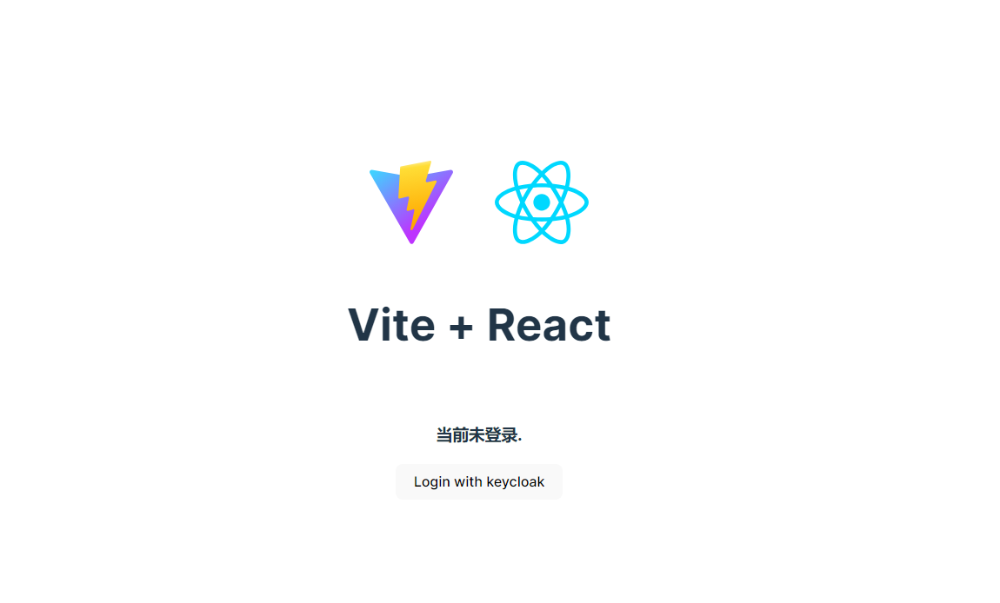

# React + OIDC

本示例是React 客户端组件集成OIDC的示例 (不适用于nextjs创建的项目)

项目由vite模板创建，客户端权限集成使用react-oidc-context。

登录后会显示用户的用户名和邮箱

## 项目启动

```bash
npm run dev
```

用户名密码 admin/admin

## 截图

- 未登录截图



- 登录后截图


## Reference

- [Vite](https://vitejs.dev/guide/) : create this project with the react-ts template of vite.
- [react-oidc-context](https://github.com/authts/react-oidc-context): Library to provide OpenID Connect (OIDC) and
   OAuth2 protocol support for client-side, browser-based JavaScript client applications.
